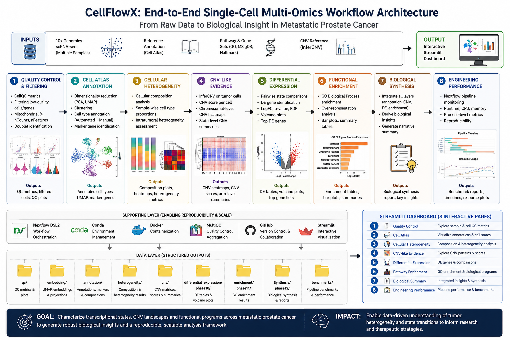

# 🧬 CellFlowX

[](https://github.com/Sriiraam/CellFlowX/actions/workflows/ci.yml)


**CellFlowX** is a production-style, reproducible single-cell RNA-seq workflow for profiling **tumor heterogeneity in metastatic prostate cancer**.

It combines single-cell biology with workflow engineering using **Scanpy, AnnData, Nextflow DSL2, Docker, SQLite, pytest, GitHub Actions, and Streamlit**.

---


## 🧬 Workflow Architecture



## 🌐 Live Demo

Explore CellFlowX directly in your browser — no local installation required.

**[Launch the CellFlowX Dashboard →](https://cellflowx.streamlit.app/)**
## 🎯 Project Objective

CellFlowX investigates:

> **How do cellular composition and transcriptional states vary across metastatic prostate cancer samples, and which cell populations and molecular programs contribute to inter-tumor heterogeneity?**

The project focuses on:

- Single-cell quality control
- Doublet detection
- Normalization and feature selection
- Dimensionality reduction
- Leiden clustering
- Cell-state annotation
- Inter-tumor heterogeneity
- CNV-like transcriptional evidence
- Tumor-state differential expression
- Functional enrichment
- Biological synthesis

---

## 📊 Dataset

**GEO:** GSE292074  
**BioProject:** PRJNA1236646  
**Organism:** Homo sapiens  
**Assay:** 10x Genomics single-cell RNA-seq  
**Study context:** Metastatic prostate cancer

CellFlowX uses processed Cell Ranger filtered feature-barcode matrices from three metastatic tumor samples:

| GEO Sample | Sample ID | Cells |
|---|---|---:|
| GSM8848584 | MH_07-042-M2 | 3,713 |
| GSM8848585 | MH_13-084-D12 | 3,988 |
| GSM8848586 | MH_13-084-D13 | 959 |

**Initial cells:** 8,660

Raw FASTQ/SRA data are not required for this implementation.

---

## 🔬 Workflow

📊 **[View the complete CellFlowX Nextflow DAG](docs/cellflowx_workflow_dag.html)**

```text
10x Filtered Matrices
        │
        ▼
AnnData Construction
        │
        ▼
QC Metrics
        │
        ├── QC Visualization
        │
        ▼
Sample-aware QC Evaluation
        │
        ▼
Doublet Detection
        │
        ▼
Final QC Filtering
        │
        ▼
Normalization + HVG Selection
        │
        ▼
PCA + Neighbors + Leiden + UMAP
        │
        ▼
Marker Discovery
        │
        ▼
Cell-state Annotation
        │
        ▼
Inter-tumor Heterogeneity
        │
        ▼
CNV-like Expression Evidence
        │
        ▼
Tumor-state Differential Expression
        │
        ▼
Functional Enrichment
        │
        ▼
Biological Synthesis
```

The complete analysis is orchestrated as a 15-process Nextflow DSL2 workflow.

🧪 Quality Control

CellFlowX performs sample-aware QC rather than applying one universal threshold across all tumors.

QC includes:

Total transcript counts
Detected genes
Mitochondrial percentage
Sample-specific filtering thresholds
Scrublet doublet detection
Final QC
Metric	Result
Raw cells	8,660
Retained cells	8,233
Removed cells	427
Retention	95.07%
Genes after preprocessing	17,106
Highly variable genes	2,000

Ribosomal QC was not artificially introduced because canonical RPL/RPS genes were absent from the supplied processed feature matrices.

🗺️ Cell Atlas

The workflow performs:

Library-size normalization
Log transformation
Highly variable gene selection
PCA
Neighborhood graph construction
Leiden clustering
UMAP visualization
Marker discovery

15 Leiden clusters were identified.

Major expression-state annotations include:

Prostate epithelial - AR high
Prostate epithelial - luminal
Neuroendocrine-like
Steroidogenic-like
Fibroblast
Activated fibroblast
Macrophage
T/NK lymphocyte
Endothelial
Cycling
Stress/hypoxia-like
Epithelial-like - uncertain

These labels represent expression states and are not automatically interpreted as definitive malignant-cell identities.

🧬 Inter-Tumor Heterogeneity

Strong compositional differences were observed across the three metastatic tumors.

Sample	QC Cells	Dominant State	Proportion
GSM8848584	3,448	Steroidogenic-like	32.74%
GSM8848585	3,858	Neuroendocrine-like	43.47%
GSM8848586	927	Activated fibroblast	56.09%

The results demonstrate substantial inter-tumor cellular and transcriptional heterogeneity.

🧬 CNV-like Malignancy Evidence

CellFlowX performs chromosome-level expression-deviation analysis relative to reference cell populations.

Strong CNV-like transcriptional evidence was observed particularly within:

AR-high prostate epithelial populations
Luminal prostate epithelial populations

These measurements provide supportive malignancy evidence only.

They are not DNA-level CNV calls and are not treated as definitive proof of malignancy.

📈 Differential Expression

Exploratory tumor-state differential expression includes:

Comparison	Significant Genes
AR-high vs Neuroendocrine-like	3,920
Luminal vs Neuroendocrine-like	3,112
AR-high vs Steroidogenic-like	4,255
Neuroendocrine-like vs Steroidogenic-like	4,429

Threshold:

FDR < 0.05
|logFC| >= 1

These comparisons are exploratory cell-state analyses and remain affected by strong sample-state confounding.

🧠 Functional Enrichment

Functional enrichment highlights distinct biological programs across tumor states.

Examples include:

Neuroendocrine-like: nervous-system development and chemical synaptic transmission
Steroidogenic-like: cholesterol metabolism
AR-high: cholesterol-associated metabolic programs
Luminal: regulation of cell migration

Enrichment results are interpreted descriptively because of the limited number of biological samples.

⚙️ Engineering Architecture

CellFlowX combines biological analysis with production-style bioinformatics engineering.

Core Technologies
Component	Technology
Workflow orchestration	Nextflow DSL2
Single-cell analysis	Scanpy / AnnData
Programming	Python
Containers	Docker
Database	SQLite
Testing	pytest
CI/CD	GitHub Actions
Dashboard	Streamlit
Version control	Git / GitHub
🚀 Execution Profiles

CellFlowX contains execution profiles for:

local
docker
slurm
azure
k8s-demo

This demonstrates portability from local development toward containerized, HPC and cloud execution environments.

Local
nextflow run main.nf -profile local
Docker
nextflow run main.nf -profile docker
Resume an interrupted workflow
nextflow run main.nf -profile docker -resume
🐳 Docker Validation

The complete CellFlowX workflow was successfully executed through the Docker profile.

All 15 processes completed successfully.

BUILD_ANNDATA              ✔
QC_METRICS                 ✔
QC_PLOTS                   ✔
EVALUATE_QC                ✔
DETECT_DOUBLETS            ✔
FINALIZE_QC                ✔
PREPROCESS                 ✔
EMBEDDING_CLUSTERING       ✔
MARKER_DISCOVERY           ✔
ANNOTATE_CELLS             ✔
TUMOR_HETEROGENEITY        ✔
CNV_MALIGNANCY             ✔
TUMOR_STATE_DE             ✔
FUNCTIONAL_ENRICHMENT      ✔
BIOLOGICAL_SYNTHESIS       ✔
⚡ Benchmarking

Nextflow trace data are summarized into process-level and project-level benchmark reports.

Metric	Result
Tasks recorded	15
Processes recorded	15
Summed task runtime	9.42 min
Peak task memory	1.3 GB
Mean task CPU	124.29%

CPU utilization above 100% reflects multi-core execution.

The 9.42-minute value represents summed task runtime, not pipeline wall-clock runtime.

Nextflow also generates:

nextflow_report.html
nextflow_timeline.html
nextflow_trace.txt
nextflow_dag.html
🗄️ SQLite Database

CellFlowX stores compact analytical summaries in SQLite.

Database tables include:

samples
celltype_composition
heterogeneity_summary
cnv_summary
de_summary
enrichment_summary

Large cell-level matrices remain in AnnData/H5AD format while lightweight summary information is available through SQLite.

🖥️ Interactive Dashboard

CellFlowX includes a multi-page Streamlit dashboard.

Dashboard sections:

Quality Control
Cell Atlas
Heterogeneity
CNV Evidence
Differential Expression
Pathway Enrichment
Biological Summary
Engineering & Performance

The dashboard combines biological interpretation with engineering and workflow performance information.

✅ Testing & CI/CD

CellFlowX includes automated repository validation using pytest and GitHub Actions.

Local validation:

pytest -q

Project validation:

python scripts/validate_project.py

GitHub Actions automatically checks:

Repository-safe unit tests
Python script compilation
Nextflow configuration syntax

Large processed biological datasets are intentionally excluded from GitHub and are validated locally.

🧾 Reproducibility & Provenance

CellFlowX records:

Python environment
Dependency versions
Git commit and branch
Nextflow version
Java version
Docker information
Dataset identifiers
QC statistics
Workflow configuration
Execution provenance

Dependencies are frozen in:

requirements.txt

QC thresholds are centralized in:

config/qc_thresholds.json
⚠️ Scientific Limitations

The dataset contains only three metastatic tumor samples and does not contain a normal/control cohort.

Therefore CellFlowX does not make claims about:

Tumor vs normal differences
Treatment response
Survival
Causality
Patient-independent population effects

Cells are not considered independent biological replicates for patient-level inference.

Strong sample-specific structure is present, meaning some transcriptional differences are confounded with sample identity.

CNV-like expression scores are supporting transcriptional evidence rather than definitive DNA-level CNV measurements.

📁 Repository Structure
CellFlowX/
├── main.nf
├── nextflow.config
├── requirements.txt
├── config/
├── manifests/
├── workflow/
│   ├── modules/
│   └── subworkflows/
├── scripts/
├── database/
├── streamlit_app/
│   ├── app.py
│   ├── pages/
│   └── utils/
├── tests/
├── docker/
├── docs/
├── results/
└── .github/
    └── workflows/
📚 Data Availability

CellFlowX uses publicly available data from:

GEO accession GSE292074

The repository does not redistribute the complete biological dataset.

👨‍💻 Author

Sriram B

B.Tech Biotechnology
Bioinformatics / Computational Genomics

📄 License

CellFlowX is released under the MIT License.

See LICENSE for details.

📖 Citation

Citation metadata are provided in:

CITATION.cff

🧬 Project Status

CellFlowX v1.0.0 — production-style portfolio release
